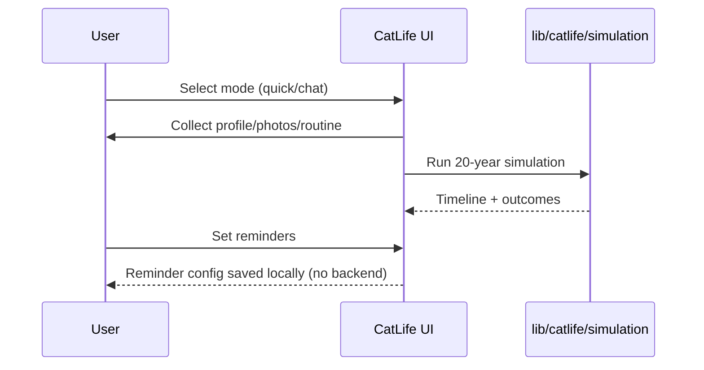

# CatLife Chat Sim (Day 5 of 30 Days of Product)

CatLife chat + avatar + 20-year simulation + reminders.

## Live demo
- Visit https://lawrencehua.com/catlife

## Problem & Solution
- **Problem:** Pet owners need quick, friendly guidance and reminders without heavy setup.
- **Solution:** Chat or quick-setup to build a profile, generate a pixel avatar, simulate 20 years, and set reminders.

## What’s inside
- Standalone Next.js app with CatLife components, types, and simulation utilities.
- No backend dependency in this extraction; reminders/config persist in-app.
- `.env.example` placeholders to fill if you add integrations.

## Run locally
1. Install deps: `npm install`
2. Copy `.env.example` to `.env` and provide your values
3. Start dev server: `npm run dev`
4. Open `http://localhost:3000`

## Notes
- For demos, use the live link above.
- Repo name: CatLife Chat Sim (Day 5 of 30 Days of Product)

## Architecture
```mermaid
flowchart TD
  U[User] --> UI[Next.js CatLife UI]
  UI --> CMP[CatLife components]
  UI --> TYPES[CatLife types]
  UI --> LIB[CatLife lib (simulation, notifications)]
```

## Sequence

